# Skin AI

Skin AI is a disability-first virtual clothing assistant. It helps people find garments that match their occasion, preferences, measurements, and access needs while reducing the number of clothes they may need to try on physically.

Virtual try-on is a visual preview only. It is not proof that a garment fits. Fit and compatibility information must come from product measurements, user-provided measurements, and explicit garment attributes.

## Disability-first scope

The MVP is designed around dressing barriers experienced by disabled people, including limited dexterity, restricted reach or shoulder movement, and pain or fatigue associated with changing clothes repeatedly.

It will initially support user-stated functional requirements such as:

- Prefer front fastenings, pull-on garments, wrap closures, or other explicitly documented closure types.
- Avoid small buttons, rear fastenings, overhead-only dressing, or other closures the user identifies as inaccessible.
- Compare available garment measurements with measurements or ranges provided by the user.
- Reduce unnecessary physical try-ons by producing a small, evidence-based shortlist before offering visual try-on.
- Clearly show when a retailer has not supplied enough accessibility or measurement information.

The application does not assume that all disabled people have the same needs. A diagnosis or disability label is never used to guess clothing requirements. Users control which functional preferences are treated as requirements and which are preferences.

## Product flow

```text
User sends a new message or follow-up
        ↓
Frontend sends the newest message and bounded conversation state
        ↓
Backend validates the message, recent turns, requirements, and product IDs
        ↓
Backend reloads any referenced product facts from the trusted catalogue
        ↓
Backend asks the LLM for a contextual reply and updated requirements
        ↓
Backend validates the complete structured response
        ↓
Frontend displays the reply
        ├── `searchReady: false` → wait for the next user message
        └── `searchReady: true` → search the grounded catalogue
                                      ↓
                            Deterministic code checks measurements
                            and access requirements
                                      ↓
                            Frontend displays an evidence-based shortlist
                                      ↓
                            User explicitly requests virtual try-on
                                      ↓
                            Backend calls YouCam and monitors the task
                                      ↓
                            Frontend displays the result with a fit disclaimer
```

## System responsibilities

### Frontend and backend responsibility flow

```mermaid
flowchart LR
    subgraph frontend["Frontend: browser"]
        request["Collect newest message and recent state"]
        reply["Display contextual reply"]
        fallback["Display tested fallback"]
        shortlist["Display grounded shortlist"]
        consent["Collect try-on consent"]
        result["Display progress and result"]
    end

    subgraph backend["Backend: Cloudflare Worker"]
        inputCheck["Validate message and conversation state"]
        context["Load trusted context"]
        interpret["Request one structured LLM response"]
        responseCheck["Validate status, reply, readiness and requirements"]
        ready{"searchReady?"}
        match["Search and check compatibility"]
        vto["Create and monitor VTO task"]
    end

    subgraph external["External services and data"]
        llm["LLM provider"]
        catalogue["Clothing catalogue"]
        youcam["YouCam API"]
    end

    request -->|"HTTPS request"| inputCheck
    inputCheck --> context
    context -.->|"Reload product facts by ID"| catalogue
    context --> interpret
    interpret -.->|"Interpret request"| llm
    interpret --> responseCheck
    responseCheck -->|"Valid"| reply
    responseCheck -->|"Valid"| ready
    responseCheck -->|"Invalid"| fallback
    ready -->|"Yes"| match
    ready -->|"No product search"| reply
    match -.->|"Query products"| catalogue
    match -->|"Validated products"| shortlist
    shortlist --> consent
    consent -->|"Authorised request"| vto
    vto -.->|"Generate preview"| youcam
    vto -->|"Status and result"| result
```



Arrows show which component initiates each action. Responses return through the backend, which prevents the frontend from receiving private API keys or executing unvalidated plans.

### Frontend

The frontend:

- Collects the user's occasion, preferences, measurements, and access needs.
- Keeps a bounded set of recent conversation turns and selected product IDs for the current MVP session.
- Sends product IDs rather than claiming product facts.
- Explains what information is optional.
- Displays the contextual reply on every valid turn, including clarification and unsupported requests.
- Displays the interpreted requirements for review when they change.
- Presents grounded products and compatibility evidence.
- Collects explicit consent before uploading a photograph.
- Shows upload, processing, success, and failure states.
- Clearly labels YouCam results as visual previews rather than fit evidence.

### Backend

The backend is the controller of the system. It:

- Validates the newest message and bounded conversation state.
- Reloads trusted product facts for any product IDs supplied as context.
- Calls the LLM once per conversational turn with the relevant recent messages and current requirements.
- Validates every field in the LLM-generated response.
- Retains the previous requirements when the LLM returns `requirements: null`.
- Searches the catalogue only when the validated response sets `searchReady` to `true`.
- Runs deterministic compatibility rules.
- Enforces permissions, limits, and consent.
- Keeps API keys secret.
- Creates YouCam tasks and checks their status.
- Returns controlled responses to the frontend.

The backend will initially run as a Cloudflare Worker, so the website and private API routes can be deployed through Cloudflare without managing a dedicated server.

### Local frontend

The repository includes a small accessible browser interface for the chat flow. Run `npm run dev`, then open `http://localhost:3000`. This origin matches the development `ALLOWED_ORIGIN` configured for the Worker.

The frontend stores the bounded conversation context in the browser's `sessionStorage`. It restores that context after a refresh and removes it when the user selects **Start over**. Only the fields permitted by `chat-request.schema.json` are sent to the backend; locally cached product display data is never treated as trusted catalogue input.

### Cloudflare Worker deployment

The implemented Worker exposes `POST /api/chat`. It checks the browser origin, request method, content type, body size, and chat-request schema before calling OpenAI. It then runs the existing orchestration and returns either a validated chat response or a controlled public error. Provider error details and API keys are never returned to the browser.

Cloudflare's Git integration can build and deploy this repository after a push; Wrangler does not have to be installed on the developer's computer. Before deploying:

1. Check that `name` in `wrangler.jsonc` exactly matches the Worker name in the Cloudflare dashboard.
2. Add `OPENAI_API_KEY` as an encrypted Worker secret in **Settings → Variables and Secrets**.
3. Add `ALLOWED_ORIGIN` as a Worker variable containing the frontend's exact origin, such as `https://skin-ai.example`. Multiple exact origins can be comma-separated.
4. Keep `OPENAI_MODEL` as the configured variable or override it in the dashboard.

For optional local Worker testing, copy `.dev.vars.example` to `.dev.vars` and replace its values. `.dev.vars` is ignored by Git and must never be committed.

### LLM

The LLM is the language interpretation layer. It:

- Uses the relevant recent messages and current requirements to understand follow-ups.
- Converts clothing requests into complete normalized requirements.
- Returns `requirements: null` when a conversational answer should not change the current requirements.
- Sets `searchReady` to indicate whether catalogue matching should run.
- Identifies occasions, garment types, preferences, and access requirements.
- Classifies requests as supported, mixed, or unsupported.
- Writes a short contextual reply about what the application can handle.

The LLM has no automatic memory between API calls; the application supplies bounded, validated context on each turn. Unless the backend explicitly supplies verified product facts, the reply cannot describe or recommend specific products. The LLM does not search arbitrary products, prove fit, invent measurements, grant consent, or bypass backend rules.

The current backend includes an OpenAI Responses API interpreter using strict Structured Outputs. Its generation schema permits only the supported-search, supported-conversation, and unsupported field combinations. The interpreter normalizes and validates the result, making at most one correction call for deeper requirements contradictions. It reads its API key from backend configuration, sends no API key in the request body, sets API response storage to false, and returns only a validated proposal to the orchestrator. Tests mock the network boundary; a live call will be tested only after `OPENAI_API_KEY` is configured as a server-side secret.

### Clothing catalogue

The catalogue is the source of product truth. It contains fields such as:

- Product ID, name, retailer, image, and product URL.
- Explicit virtual-try-on readiness and trusted provider configuration.
- Garment type and available sizes.
- Garment measurements where available.
- Closure and fastening type.
- Stretch or construction attributes where explicitly supplied.
- Source and provenance of each attribute.

The MVP will start with a small, clearly labelled mock catalogue. Products must never be invented by the LLM or presented as real retailer listings.

### Later: retailer catalogue enrichment

After the local matching flow works, an authorised retailer API can supply basic product data such as product ID, name, price, image URL, product URL, sizes, variants, and availability. The backend will normalise that data into the application's internal catalogue format and add accessibility attributes through a separate enrichment step.

Manual verification means reviewing explicit retailer evidence, including the product description, specification section, closure details, and size guide. Images may support that review, but an image alone is not sufficient evidence for closure location, dressing method, or accessibility.

Each enriched attribute records its evidence and status:

```json
{
  "closureLocation": {
    "value": "front",
    "status": "manually_verified",
    "sourceText": "Front zip fastening with a large ring pull.",
    "sourceUrl": "https://retailer.example/product/123",
    "verifiedAt": "2026-08-04"
  }
}
```

Allowed evidence states include:

- `retailer_provided`: supplied directly as a structured retailer attribute.
- `manually_verified`: explicitly supported by retailer text or specifications and reviewed by a person.
- `unknown`: the available evidence is insufficient.

An LLM may suggest attributes extracted from product text, but suggested values remain unverified until reviewed. The application must never convert an ambiguous image or description into a confirmed accessibility fact. These labels describe garment properties, not universal suitability for disabled people.

### YouCam

YouCam generates the visual clothing try-on. It does not decide whether the garment physically fits and is not the source of garment measurements.

## Conversational interpretation and normalized requirements

The LLM returns one JSON object containing:

- `requestStatus`: whether the request is `supported`, `mixed`, or `unsupported`.
- `searchReady`: whether the backend may run catalogue matching.
- `reply`: a short contextual message for the user.
- `requirements`: a complete replacement for the current normalized requirements, or `null` when they should remain unchanged.

This provides natural conversational wording and controlled matching input with one LLM call per user message.

Example user request:

> I have limited hand dexterity and shoulder movement. I need a wedding-guest dress without small buttons, a back zip, or an overhead-only design.

Example response:

```json
{
  "requestStatus": "supported",
  "searchReady": true,
  "reply": "I’ll look for wedding-guest dresses with documented front or wrap fastenings and exclude the closures you identified as inaccessible.",
  "requirements": {
    "garmentTypes": ["dress"],
    "occasion": "wedding_guest",
    "requiredAccess": {
      "closureLocation": ["front"],
      "dressingMethod": ["full_front_opening", "wrap"]
    },
    "excludedAccess": {
      "closureType": ["buttons"],
      "closureLocation": ["back"],
      "dressingMethod": ["overhead"]
    },
    "preferredAccess": {},
    "requiredMeasurements": []
  }
}
```

Example follow-up question that does not change the search:

> What does a full front opening mean?

```json
{
  "requestStatus": "supported",
  "searchReady": false,
  "reply": "It means the garment opens completely down the front rather than only opening at the neckline.",
  "requirements": null
}
```

Here, `requirements: null` means that the backend keeps the existing requirements unchanged. A requirements object always represents the complete current state rather than a partial patch.

For a completely unsupported request, `requestStatus` is `unsupported`, `searchReady` is `false`, and `requirements` is `null`. The contextual reply may explain the application's clothing-related scope without requiring a second LLM call.

The entire response is an untrusted proposal. The backend decides whether the reply may be displayed and whether any searches may be executed.

## Validation pipeline

Validation happens before and after the LLM call.

### Raw input validation

Before calling the LLM, the backend checks:

- The current message exists, is a string, and is not empty.
- Recent messages and conversation state follow their strict schemas and bounded limits.
- Referenced product IDs exist in the trusted catalogue before any product facts are used.
- Length and request-size limits are respected.
- The request contains no unexpected fields.
- Uploaded files use permitted types and sizes.
- Rate limits and relevant permissions are satisfied.

### Structured-response validation

Before searching the catalogue, the backend checks:

1. **Schema:** required fields, data types, strict JSON shape, and unknown fields.
2. **Status rules:** `unsupported` requires `searchReady: false` and `requirements: null`.
3. **Readiness rules:** `searchReady: true` requires `supported` or `mixed` status and a complete valid requirements object.
4. **Reply safety:** plain text only, a strict length limit, no links or HTML, and a tested static fallback when the reply is missing or invalid.
5. **Allowed values:** approved garment types, occasions, closures, and measurement names.
6. **Business rules:** no contradictions, unsupported claims, or measurement checks without data.
7. **Execution limits:** maximum results and concurrent downstream requests.
8. **Permissions:** photo processing and virtual try-on cannot begin without explicit user action and consent.

An invalid response is never executed. The backend may attempt one controlled repair, validate it again, and otherwise return a user-friendly error.

```text
LLM proposes → backend validates → backend executes
```

## Compatibility checks

Compatibility is calculated by deterministic application code rather than the LLM or YouCam.

Each result should distinguish between:

- Confirmed compatible attributes.
- Confirmed conflicts.
- Missing product information.
- Preferences rather than strict requirements.

The interface must explain the evidence behind a result and avoid guarantees such as “this will fit.”

## YouCam virtual try-on flow

The browser does not call authenticated YouCam endpoints directly because that would expose the API key.

```text
1. User selects a product and gives photo-processing consent.
2. Frontend sends file metadata to the Cloudflare Worker.
3. Worker requests a signed upload URL and file ID from YouCam.
4. Frontend uploads the image to the signed URL.
5. Frontend asks the Worker to create a virtual try-on task.
6. Worker calls YouCam and returns a task ID.
7. Frontend periodically asks the Worker for the task status.
8. Worker checks YouCam until the task succeeds or fails.
9. Frontend displays the result or a recoverable error.
```

Planned backend routes:

```text
POST /api/search
POST /api/vto/upload
POST /api/vto/tasks
GET  /api/vto/tasks/:taskId
```

The actual image upload may go directly from the browser to the temporary signed upload URL. Creating upload URLs, creating tasks, and checking status still go through the backend.

## Security and privacy rules

- Store `YOUCAM_API_KEY` as an encrypted Cloudflare secret.
- Never expose API keys to frontend code or commit them to Git.
- Require explicit consent before sending a user's photograph to YouCam.
- Validate file format and size before processing.
- Collect only information needed for the requested feature.
- Do not infer medical conditions from clothing preferences or photographs.
- Do not retain photographs or generated images longer than necessary.
- Treat all LLM output as untrusted input.
- Log operational errors without logging sensitive photographs or measurements.

## MVP build order

1. Define the request and catalogue schemas.
2. Create a small grounded mock catalogue.
3. Build and test deterministic catalogue matching.
4. Add conversation-aware LLM interpretation and server-side validation.
5. Build the accessible shortlist interface.
6. Add the backend YouCam integration and progress states.
7. Test consent, keyboard navigation, screen-reader labels, and error recovery.
8. Connect an authorised retailer API for basic product data.
9. Manually verify and enrich a small real-product catalogue, preserving evidence and marking missing attributes as `unknown`.
10. Add a controlled tool-using agent only after the individual workflow steps are reliable.
