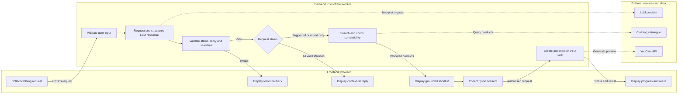

# Skin AI

Skin AI is a disability-first virtual clothing assistant. It helps people find garments that match their occasion, preferences, measurements, and access needs while reducing the number of clothes they may need to try on physically.

Virtual try-on is a visual preview only. It is not proof that a garment fits. Fit and compatibility information must come from product measurements, user-provided measurements, and explicit garment attributes.

## Product flow

```text
User describes what they need
        ↓
Frontend sends the request to our backend
        ↓
Backend validates the raw input
        ↓
Backend asks the LLM for intent, a contextual reply, and a search plan
        ↓
Backend validates the complete structured response
        ↓
Backend searches a grounded clothing catalogue
        ↓
Deterministic code checks measurements and access requirements
        ↓
Frontend displays an evidence-based shortlist
        ↓
User selects a garment and explicitly requests virtual try-on
        ↓
Backend calls YouCam and monitors the asynchronous task
        ↓
Frontend displays the generated image with a fit disclaimer
```

## System responsibilities

### Frontend and backend responsibility flow



Arrows show which component initiates each action. Responses return through the backend, which prevents the frontend from receiving private API keys or executing unvalidated plans.

### Frontend

The frontend:

- Collects the user's occasion, preferences, measurements, and access needs.
- Explains what information is optional.
- Displays the interpreted request for review.
- Presents grounded products and compatibility evidence.
- Collects explicit consent before uploading a photograph.
- Shows upload, processing, success, and failure states.
- Clearly labels YouCam results as visual previews rather than fit evidence.

### Backend

The backend is the controller of the system. It:

- Validates incoming requests.
- Calls the LLM once for intent, a contextual reply, and a search plan.
- Validates every field in the LLM-generated response.
- Searches the catalogue.
- Runs deterministic compatibility rules.
- Enforces permissions, limits, and consent.
- Keeps API keys secret.
- Creates YouCam tasks and checks their status.
- Returns controlled responses to the frontend.

The backend will initially run as a Cloudflare Worker, so the website and private API routes can be deployed through Cloudflare without managing a dedicated server.

### LLM

The LLM is the language interpretation layer. It:

- Converts conversational requests into structured search plans.
- Identifies occasions, garment types, preferences, and access requirements.
- Classifies requests as supported, mixed, or unsupported.
- Writes a short contextual reply about what the application can handle.

This first LLM call has not seen the catalogue results, so its reply cannot describe or recommend specific products. The LLM does not search arbitrary products, prove fit, invent measurements, grant consent, or bypass backend rules.

### Clothing catalogue

The catalogue is the source of product truth. It contains fields such as:

- Product ID, name, retailer, image, and product URL.
- Garment type and available sizes.
- Garment measurements where available.
- Closure and fastening type.
- Stretch or construction attributes where explicitly supplied.
- Source and provenance of each attribute.

The MVP will start with a small mock catalogue. Products must never be invented by the LLM.

### YouCam

YouCam generates the visual clothing try-on. It does not decide whether the garment physically fits and is not the source of garment measurements.

## Structured interpretation and search plans

The LLM returns one JSON object containing:

- `requestStatus`: whether the request is `supported`, `mixed`, or `unsupported`.
- `reply`: a short contextual message for the user.
- `searches`: catalogue searches proposed for the supported parts of the request.

This provides contextual wording and a search plan with one LLM call.

Example user request:

> I need a petite wedding-guest dress. Back zips are difficult, and I prefer something below the knee.

Example search plan:

```json
{
  "requestStatus": "supported",
  "reply": "I’ll look for petite wedding-guest dresses that avoid back zips and provide garment-length information.",
  "searches": [
    {
      "garmentType": "dress",
      "occasion": "wedding_guest",
      "searchTerm": "petite midi dress",
      "requiredClosures": ["pull_on", "front_zip"],
      "excludedClosures": ["back_zip"],
      "requiredMeasurements": ["garment_length_cm"]
    }
  ]
}
```

Example mixed request:

> Book me a hotel and find a pull-on travel outfit.

```json
{
  "requestStatus": "mixed",
  "reply": "I can’t book a hotel, but I can help you find a pull-on travel outfit.",
  "searches": [
    {
      "garmentType": "outfit",
      "occasion": "travel",
      "searchTerm": "pull-on travel outfit",
      "requiredClosures": ["pull_on"],
      "excludedClosures": [],
      "requiredMeasurements": []
    }
  ]
}
```

For a completely unsupported request, `requestStatus` is `unsupported` and `searches` must be empty. The contextual reply may explain the application's clothing-related scope without requiring a second LLM call.

The entire response is an untrusted proposal. The backend decides whether the reply may be displayed and whether any searches may be executed.

## Validation pipeline

Validation happens before and after the LLM call.

### Raw input validation

Before calling the LLM, the backend checks:

- The prompt exists, is a string, and is not empty.
- Length and request-size limits are respected.
- The request contains no unexpected fields.
- Uploaded files use permitted types and sizes.
- Rate limits and relevant permissions are satisfied.

### Search-plan validation

Before searching the catalogue, the backend checks:

1. **Schema:** required fields, data types, strict JSON shape, and unknown fields.
2. **Status rules:** `unsupported` requires zero searches, `supported` requires at least one search, and `mixed` may execute only its valid clothing searches.
3. **Reply safety:** plain text only, a strict length limit, no links or HTML, and a tested static fallback when the reply is missing or invalid.
4. **Allowed values:** approved garment types, occasions, closures, and measurement names.
5. **Business rules:** no contradictions, unsupported claims, or measurement checks without data.
6. **Execution limits:** maximum searches, results, and concurrent downstream requests.
7. **Permissions:** photo processing and virtual try-on cannot begin without explicit user action and consent.

An invalid plan is never executed. The backend may attempt one controlled repair, validate it again, and otherwise return a user-friendly error.

```text
LLM proposes → backend validates → backend executes
```

## Compatibility checks

Compatibility is calculated by deterministic application code rather than the LLM or YouCam.

Each result should distinguish between:

- Confirmed compatible attributes.
- Confirmed conflicts.
- Missing product information.
- Preferences rather than strict requirements.

The interface must explain the evidence behind a result and avoid guarantees such as “this will fit.”

## YouCam virtual try-on flow

The browser does not call authenticated YouCam endpoints directly because that would expose the API key.

```text
1. User selects a product and gives photo-processing consent.
2. Frontend sends file metadata to the Cloudflare Worker.
3. Worker requests a signed upload URL and file ID from YouCam.
4. Frontend uploads the image to the signed URL.
5. Frontend asks the Worker to create a virtual try-on task.
6. Worker calls YouCam and returns a task ID.
7. Frontend periodically asks the Worker for the task status.
8. Worker checks YouCam until the task succeeds or fails.
9. Frontend displays the result or a recoverable error.
```

Planned backend routes:

```text
POST /api/search
POST /api/vto/upload
POST /api/vto/tasks
GET  /api/vto/tasks/:taskId
```

The actual image upload may go directly from the browser to the temporary signed upload URL. Creating upload URLs, creating tasks, and checking status still go through the backend.

## Security and privacy rules

- Store `YOUCAM_API_KEY` as an encrypted Cloudflare secret.
- Never expose API keys to frontend code or commit them to Git.
- Require explicit consent before sending a user's photograph to YouCam.
- Validate file format and size before processing.
- Collect only information needed for the requested feature.
- Do not infer medical conditions from clothing preferences or photographs.
- Do not retain photographs or generated images longer than necessary.
- Treat all LLM output as untrusted input.
- Log operational errors without logging sensitive photographs or measurements.

## MVP build order

1. Define the request and catalogue schemas.
2. Create a small grounded mock catalogue.
3. Build and test deterministic catalogue matching.
4. Add LLM search-plan generation and server-side validation.
5. Build the accessible shortlist interface.
6. Add the backend YouCam integration and progress states.
7. Test consent, keyboard navigation, screen-reader labels, and error recovery.
8. Add a controlled tool-using agent only after the individual workflow steps are reliable.
