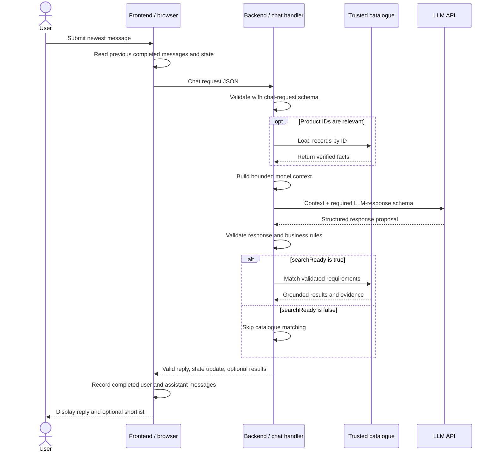

# Skin AI Conversation Flow

This document explains how a new message moves from the user interface to the backend and the LLM, how follow-up messages receive conversational context, when state changes, and what each schema protects.

It focuses on the conversational search flow. Product matching and virtual try-on are downstream workflows with their own rules.

## Current implementation status

The repository currently contains the schemas, mock catalogue, tested deterministic matcher, tested backend-to-frontend response adapter, tested framework-independent chat orchestrator, and a tested OpenAI Responses API interpreter. It does not yet contain a frontend chat component, a Cloudflare `/api/chat` HTTP handler, a configured server-side API key, a live LLM verification call, or a conversation database.

The persistence described below is therefore the planned MVP behaviour:

- Recent messages and conversation state live temporarily in frontend memory while the page remains open.
- Closing or refreshing the page loses that temporary state.
- Durable backend persistence by `conversationId` is a later improvement.

The schemas define the contracts that the future frontend and backend code must follow. A schema validates data; it does not store, transform, or send data by itself.

The implemented [`handleChatTurn`](../../src/chat/handle-chat-turn.js) function now connects those contracts in plain JavaScript. It is the workflow that a future Cloudflare Worker will call; it is not itself an internet endpoint.

```text
Cloudflare Worker HTTP handler (not implemented yet)
        ↓ calls
handleChatTurn (implemented and tested)
        ↓ coordinates
validation → interpretation → optional matching → response adapter
```

The interpreter is injected into the function. Most orchestration tests supply a fake interpreter. The implemented OpenAI interpreter uses the Responses API with strict Structured Outputs, but its network tests also use an injected fake `fetch`, so the test suite remains deterministic and free from API keys or model costs.

## Mental model

```text
User speaks naturally
        ↓
Frontend remembers the visible conversation
        ↓
Backend validates and adds trusted context
        ↓
LLM interprets the language and proposes structured output
        ↓
Backend validates and decides whether matching may run
        ↓
Frontend displays the reply and any grounded results
```

The responsibilities remain separate:

```text
Frontend remembers and displays.
Backend controls and executes.
LLM interprets and proposes.
Catalogue supplies product truth.
Schemas define and validate the boundaries.
```

## What is each schema for?

| Schema | Direction | Purpose | Is it supplied to the LLM? |
| --- | --- | --- | --- |
| [`chat-request.schema.json`](../../schemas/chat-request.schema.json) | Frontend → backend | Validates the newest message, recent visible messages, current requirements, and product ID references. | No. The backend uses it before constructing the model input. |
| [`user-requirements.schema.json`](../../schemas/user-requirements.schema.json) | Shared nested structure | Defines the controlled clothing vocabulary used for matching. It is referenced by the chat request and canonical LLM response schemas. | Indirectly. The OpenAI generation schema repeats its approved vocabulary using provider-compatible rules. |
| [`llm-response.schema.json`](../../schemas/llm-response.schema.json) | LLM → backend | Applies the canonical server validation to `requestStatus`, `searchReady`, `reply`, and normalized `requirements`, including conditional business rules. | No. It contains conditions unsupported by OpenAI Structured Outputs and is applied after generation. |
| [`openai-llm-response.schema.json`](../../schemas/openai-llm-response.schema.json) | Backend → OpenAI | Uses an OpenAI-only `result` wrapper containing three mutually exclusive variants: supported search, supported conversation without search, or unsupported. Nullable placeholders are normalized before server validation. | Yes. It is the generation-time output contract. |
| [`product.schema.json`](../../schemas/product.schema.json) | Catalogue → backend | Defines trusted product records, measurements, accessibility facts, and evidence states. | Not for ordinary language interpretation. The backend may supply selected verified facts when they are necessary to answer a product question. |
| [`chat-response.schema.json`](../../schemas/chat-response.schema.json) | Backend → frontend | Defines the authoritative reply, current requirements, search state, product-card image URLs, and grounded compatibility summaries displayed by the frontend. | No. It validates the final response after LLM interpretation and optional matching are complete. |

The schema files do not perform conversion. The implemented backend workflow performs the conversion and orchestration:

```text
Schema = blueprint and validator
handleChatTurn = transformer and orchestrator
Future Cloudflare handler = HTTP entrance and exit
```

## What conversation state do we need?

The frontend needs two related forms of state.

### Visible message history

This is the text shown in the chat interface:

```json
[
  {
    "role": "user",
    "content": "Find me a front-opening dress."
  },
  {
    "role": "assistant",
    "content": "I’ll look for dresses with documented front openings."
  }
]
```

Only visible `user` and `assistant` messages belong here. Private system instructions, API keys, schema definitions, catalogue records, and raw LLM JSON do not belong in frontend message history.

The MVP sends no more than the 12 most recent completed messages. Keeping the history bounded controls request size and avoids sending an unlimited transcript to the model.

### Structured conversation state

This holds data needed for controlled follow-ups:

```json
{
  "currentRequirements": {
    "garmentTypes": ["dress"],
    "requiredAccess": {
      "closureLocation": ["front"]
    },
    "excludedAccess": {},
    "preferredAccess": {},
    "requiredMeasurements": []
  },
  "lastDisplayedProductIds": [
    "mock-dress-001",
    "mock-dress-003"
  ],
  "selectedProductId": null
}
```

Messages provide conversational wording. Structured state provides stable machine-readable memory. The model should not have to recover the current requirements by rereading the whole conversation on every turn.

Product IDs are references, not product facts. The browser may say that `mock-dress-001` was displayed, but the backend must load its name, fastening, measurements, and evidence from the trusted catalogue.

## How are user and assistant messages persisted?

The planned frontend chat component keeps a message array and structured state in JavaScript memory:

```js
let messages = [];

let conversationState = {
  currentRequirements: null,
  lastDisplayedProductIds: [],
  selectedProductId: null
};
```

For each successful turn:

1. The frontend reads the messages already displayed.
2. The user submits a new message.
3. The frontend shows the user's message, usually as a pending message.
4. The frontend sends the previous completed messages separately from the new `currentMessage` so the new message is not duplicated.
5. After the backend returns a validated response, the frontend records the assistant's `reply` text.
6. If the response contains a requirements object, the current requirements are replaced with that complete object.
7. If the response contains `requirements: null`, the previous requirements remain unchanged.
8. If matching runs, the frontend records the product IDs actually returned by the backend.

Conceptually:

```text
Before turn 1: []

Send A using recentMessages: []
Receive B
Stored history: [A, B]

Send C using recentMessages: [A, B]
Receive D
Stored history: [A, B, C, D]
```

This is temporary memory, not durable persistence. The project should not place photographs, API keys, or unprotected sensitive measurements into browser storage. If the product later needs conversations to survive refreshes or work across devices, the backend should store state by `conversationId`, apply retention rules, and let the frontend send only the ID and newest message.

## What is the complete flow for a new message?

### Stage 1: the user submits text

Suppose the visible history is empty and the user writes:

> Find me a dress with a front opening. I cannot reach a back zip.

The frontend keeps that text as the current message. It does not attempt to translate “front opening” or “cannot reach” into catalogue fields.

### Stage 2: the frontend builds the chat request

The frontend creates an object that follows the chat-request schema:

```json
{
  "conversationId": null,
  "currentMessage": "Find me a dress with a front opening. I cannot reach a back zip.",
  "recentMessages": [],
  "conversationState": {
    "currentRequirements": null,
    "lastDisplayedProductIds": [],
    "selectedProductId": null
  }
}
```

This object will be sent to the planned `POST /api/chat` backend route.

### Stage 3: the backend validates the chat request

The backend checks the object with `chat-request.schema.json` before calling the LLM. Among other rules, it verifies:

- `currentMessage` is a non-empty string no longer than 2,000 characters.
- There are no more than 12 recent messages.
- Message roles are only `user` or `assistant`.
- Current requirements use the approved vocabulary.
- Product ID references have a valid shape.
- No unexpected fields or browser-supplied product facts were inserted.

Invalid input stops here and produces a typed internal error. It is not forwarded to the model. The future Cloudflare handler will convert that internal error into a controlled public HTTP response.

This is the first node in the implemented `handleChatTurn` workflow. The workflow uses explicit functions and one conditional branch rather than a graph framework:

```text
validate_request
        ↓
load_trusted_context
        ↓
interpret_message
        ↓
validate_interpretation
        ↓
searchReady? ── yes → match_catalogue
        ↓                    ↓
        └──────────→ build_response
```

Each failure identifies the step that failed. Invalid browser data stops before the interpreter, invalid model output stops before matching, and a matching failure stops before the final response is assembled.

### Stage 4: the backend enriches the runtime context

Runtime enrichment means adding trusted information needed for this turn. It is different from retailer catalogue enrichment.

```text
Retailer catalogue enrichment
→ records and verifies garment facts before users search

Conversation context enrichment
→ loads already trusted facts needed for the current turn
```

For a first request there may be no product context to add. For a later product question, the backend uses `lastDisplayedProductIds` or `selectedProductId` to reload the relevant product records from the catalogue. It never accepts product descriptions, measurements, or accessibility claims from the browser as truth.

### Stage 5: the backend constructs the model input

The backend converts the validated request into the provider's message format. The model input contains:

```text
Private system instructions
+ approved vocabulary and interpretation rules
+ bounded recent visible messages
+ current normalized requirements
+ trusted product facts when relevant
+ newest user message
```

Conceptually:

```text
SYSTEM:
Interpret functional clothing requirements. Do not infer needs from a diagnosis.
Use only the approved vocabulary. Do not claim unsupplied product facts.

CURRENT REQUIREMENTS:
None yet.

RECENT CONVERSATION:
None yet.

NEW USER MESSAGE:
Find me a dress with a front opening. I cannot reach a back zip.
```

For the OpenAI implementation, the backend supplies `openai-llm-response.schema.json` as the strict generation-time output format. OpenAI Structured Outputs requires every object field to be required and does not support conditional `if`/`then` rules. The generation schema therefore places the interpretation inside a `result` property whose nested `anyOf` permits only three complete combinations:

```text
supported or mixed + searchReady true  + requirements object
supported or mixed + searchReady false + requirements object or null
unsupported        + searchReady false + requirements null
```

The interpreter unwraps `result` and removes nullable placeholders. The normalized result is then checked against the stricter `llm-response.schema.json` and deterministic requirements rules. The OpenAI-only wrapper never reaches `handleChatTurn` or the frontend. The chat-request schema is not sent as the model's output format.

### Stage 6: the LLM returns a structured proposal

The expected response is:

```json
{
  "requestStatus": "supported",
  "searchReady": true,
  "reply": "I’ll look for dresses with documented front openings and exclude back fastenings.",
  "requirements": {
    "garmentTypes": ["dress"],
    "requiredAccess": {
      "closureLocation": ["front"]
    },
    "excludedAccess": {
      "closureLocation": ["back"]
    },
    "preferredAccess": {},
    "requiredMeasurements": []
  }
}
```

The LLM interprets language, but it does not execute a search. The response is an untrusted proposal even though it follows the requested JSON shape.

### Stage 7: the backend validates the LLM response

The backend validates the response with `llm-response.schema.json` and the nested user-requirements schema. Important rules include:

```text
unsupported
→ searchReady must be false
→ requirements must be null

searchReady true
→ status must be supported or mixed
→ complete valid requirements must be present

requirements object
→ complete replacement for current requirements

requirements null
→ keep current requirements unchanged
```

The backend also applies business rules that the generation schema cannot fully express, such as a closure being both required and excluded or a minimum measurement exceeding its maximum. If the first normalized result fails these checks, the interpreter makes one correction call containing the normalized result and concise validation problems. The corrected result must pass the same checks. There is no unlimited retry loop:

```text
first result valid       → continue
first result invalid     → one correction call
corrected result valid   → continue
corrected result invalid → stop before matching
```

An invalid response is never executed. The future Cloudflare handler will convert the final typed failure into a controlled public response.

### Stage 8: the backend decides whether to match products

The backend always returns a valid contextual reply. It only runs deterministic catalogue matching when the validated response contains `searchReady: true`.

```text
searchReady false
→ return the reply
→ do not search

searchReady true
→ use the validated requirements
→ run deterministic matching against trusted products
→ return the reply and grounded results
```

The LLM does not decide which product is compatible. Matching code compares the normalized requirements with verified facts from records that follow `product.schema.json`.

### Stage 9: the frontend records the completed turn

After the backend succeeds, the frontend:

- Adds the user's message and the assistant's `reply` to visible history.
- Replaces `currentRequirements` if a new complete requirements object was returned.
- Keeps the previous requirements if the response used `null`.
- Records only the product IDs returned by the backend as the latest displayed results.
- Renders the reply and any result explanations.

These values become the context for the next user message.

## How can the user follow up?

The model has no automatic memory of an earlier API call. A follow-up works because the next request includes relevant visible messages and structured state.

### Follow-up that changes the search

Previous requirement:

```text
Dress with a front opening; avoid a back fastening.
```

New message:

> Actually, I cannot use zips either.

The frontend sends the new message with recent history and the existing complete requirements. The LLM should return a complete replacement rather than a partial patch:

```json
{
  "requestStatus": "supported",
  "searchReady": true,
  "reply": "Understood. I’ll keep the front-opening requirement and exclude both zips and back fastenings.",
  "requirements": {
    "garmentTypes": ["dress"],
    "requiredAccess": {
      "closureLocation": ["front"]
    },
    "excludedAccess": {
      "closureType": ["zip"],
      "closureLocation": ["back"]
    },
    "preferredAccess": {},
    "requiredMeasurements": []
  }
}
```

The backend validates the full replacement and runs matching again.

### Follow-up that asks for an explanation

New message:

> What does a full front opening mean?

The requirements do not need to change, and no new search is required:

```json
{
  "requestStatus": "supported",
  "searchReady": false,
  "reply": "It means the garment opens completely down the front instead of opening only at the neckline.",
  "requirements": null
}
```

The frontend displays and records the reply. The backend retains the existing requirements.

### Follow-up about a displayed product

New message:

> Why did this dress match?

The request contains only product ID references. The backend reloads their verified catalogue records before constructing the LLM context. The model may explain only facts supplied by the backend. If the product reference is missing or ambiguous, the reply should ask the user to identify the product rather than inventing an answer.

### Irrelevant request

New message:

> Book me a flight.

The LLM can still produce a conversational boundary response:

```json
{
  "requestStatus": "unsupported",
  "searchReady": false,
  "reply": "I can’t book flights, but I can help with clothing searches and dressing requirements.",
  "requirements": null
}
```

The backend displays the reply and does not search the catalogue. Existing requirements remain in application state unless the product deliberately implements a separate “start over” control.

## What is sent at each stage?

| Stage | Sender → receiver | Data sent | Schema or control |
| --- | --- | --- | --- |
| User input | User → frontend | New natural-language message | Frontend length and empty-input checks |
| Chat API request | Frontend → backend | Current message, recent visible messages, current requirements, recent product IDs | `chat-request.schema.json` |
| Trusted lookup | Backend → catalogue | Product IDs only | Backend authorization and catalogue lookup rules |
| Model input | Backend → LLM | Private instructions, bounded history, current requirements, trusted product context, newest message | Backend prompt builder; input is not controlled by the LLM-response schema |
| Model output contract | Backend → LLM | OpenAI-compatible allowed output structure | `openai-llm-response.schema.json` |
| Model response | LLM → backend | Status, readiness, reply, requirements or `null` | Same response schemas are used again for server validation |
| Matching input | Backend → matcher | Validated requirements and trusted product records | `user-requirements.schema.json` and `product.schema.json` |
| UI result | Backend → frontend | Validated reply, authoritative current state, product image URLs, and grounded results when applicable | `chat-response.schema.json` |
| Next turn | Frontend → backend | Updated bounded history and state plus the next message | The loop returns to `chat-request.schema.json` |

## Sequence diagram



## How do the schemas help together?

Without the chat-request schema, malformed or oversized browser context could reach the backend logic or model. Without the LLM-response schema, the model could return arbitrary fields or an unusable response. Without the user-requirements schema, the model and matcher might use incompatible words for the same need. Without the product schema, unknown or weakly evidenced product claims could be treated as confirmed facts.

Together they form a controlled chain:

```text
Natural language
        ↓
Validated conversational input
        ↓
Structured and validated requirements
        ↓
Deterministic comparison with evidenced product facts
        ↓
Explainable result
```

The schemas reduce ambiguity, but the backend still remains responsible for transformation, trusted lookups, business-rule validation, execution limits, state updates, and error recovery.

## Remaining implementation work

This document describes the target MVP flow. The framework-independent orchestrator and OpenAI interpreter now exist. The interpreter is tested through mocked network responses because no local API key is configured. The next code tasks are:

1. Implement the Cloudflare `POST /api/chat` HTTP wrapper and inject `OPENAI_API_KEY`, `OPENAI_MODEL`, and the mock catalogue.
2. Configure the secret in Cloudflare and run one controlled live interpretation request.
3. Implement the frontend in-memory conversation state and call the deployed API.
4. Render the returned reply, product images, compatibility evidence, and missing-information state.
5. Add rate limiting, controlled public fallbacks, and request tracing at the Cloudflare boundary.
6. Decide later whether durable backend conversation storage is needed.
